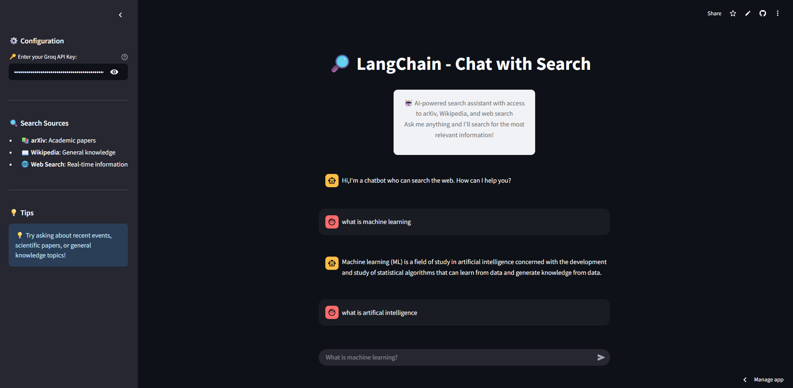

# 🔎 LangChain Search Engine Chat

A Streamlit-based chatbot that can search the web using multiple sources including Arxiv, Wikipedia, and DuckDuckGo. Built with LangChain and powered by Groq's Llama3 model.

## 🚀 **Live Demo**

### 🌐 **Try it Now - No Setup Required!**
**👉 [Launch Live Demo](https://searchbot-ai-harshcodess.streamlit.app/) 👈**

Experience the power of context-aware search right in your browser! The live demo showcases all features including:
- ✅ Real-time web search across multiple sources
- ✅ Context memory that remembers your conversation
- ✅ Intelligent follow-up question handling
- ✅ Lightning-fast Groq Llama3 responses

> 🔥 **Just enter your Groq API key and start chatting instantly!**

## 🌟 Key Features

### 🧠 **Context Memory - The Game Changer**
This search engine chatbot **remembers your entire conversation history**, making it incredibly powerful for:
- **Follow-up questions**: Ask "tell me more about that" and it knows exactly what you're referring to
- **Contextual searches**: Build upon previous topics without repeating information
- **Coherent conversations**: Maintains thread of discussion across multiple queries
- **Personalized responses**: Adapts answers based on your previous interests and questions

### 🔍 **Multi-Source Intelligence**
- **Arxiv Integration**: Access latest academic papers and research
- **Wikipedia Search**: Comprehensive encyclopedia knowledge
- **DuckDuckGo Web Search**: Real-time web information
- **Smart Agent**: Intelligently chooses the best source for your query

## 📸 Demo

### 🌟 **Live Application**
**🔗 [https://searchbot-ai-harshcodess.streamlit.app/](https://searchbot-ai-harshcodess.streamlit.app/)**

### Application Interface

*Clean and intuitive chat interface*

### Live Demo

*See the context memory in action - notice how it remembers previous conversations!*

## Features

- **🧠 Context Memory**: Remembers your entire chat history for coherent, contextual conversations
- **Multi-source Search**: Integrates Arxiv, Wikipedia, and DuckDuckGo search
- **Real-time Chat**: Interactive chat interface with streaming responses
- **Agent-based Architecture**: Uses LangChain agents for intelligent query handling
- **Streamlit UI**: Clean and intuitive web interface

## 🔑 Getting Your Groq API Key

### Why Groq?
Groq provides lightning-fast inference for Llama3 models, making your chat experience smooth and responsive.

### Step-by-Step Guide:
1. **Visit Groq Console**: Go to [console.groq.com](https://console.groq.com/)
2. **Sign Up**: Create a free account (GitHub/Google sign-in available)
3. **Navigate to API Keys**: Find "API Keys" in the left sidebar
4. **Create New Key**: Click "Create API Key"
5. **Copy Your Key**: Save it securely - you won't see it again!
6. **Free Tier**: Groq offers generous free usage limits

> ⚠️ **Important**: Keep your API key secure and never share it publicly!

## 💡 How Context Memory Works

The chatbot maintains conversation context through:

1. **Session State Management**: Your chat history is preserved throughout the session
2. **Contextual Understanding**: Each new query is processed with full conversation context
3. **Intelligent Responses**: The AI understands references to previous topics
4. **Seamless Experience**: No need to repeat information or context

**Example Conversation:**
```
You: "What is quantum computing?"
Bot: [Detailed explanation about quantum computing]

You: "How does it compare to classical computing?"
Bot: [Compares quantum vs classical, referencing the previous explanation]

You: "Show me recent papers on this topic"
Bot: [Searches Arxiv for quantum computing papers, knowing the context]
```

## Prerequisites

- Python 3.8 or higher
- Groq API Key (get it from [Groq Console](https://console.groq.com/))

## Local Setup

1. **Clone the repository**
   ```bash
   git clone <your-repo-url>
   cd "search engine GEN AI"
   ```

2. **Create virtual environment**
   ```bash
   python -m venv venv
   source venv/bin/activate  # On Windows: venv\Scripts\activate
   ```

3. **Install dependencies**
   ```bash
   pip install -r requirements.txt
   ```

4. **Set up environment variables**
   Create a `.env` file in the root directory:
   ```
   GROQ_API_KEY=your_groq_api_key_here
   ```

5. **Run the application**
   ```bash
   streamlit run "5-Search Engine/app.py"
   ```

## Deployment on Streamlit Cloud

### Step 1: Prepare Your Repository
1. Push your code to GitHub/GitLab/Bitbucket
2. Ensure `.gitignore` excludes `.env` file
3. Make sure `requirements.txt` is in the root directory

### Step 2: Deploy on Streamlit Cloud
1. Go to [share.streamlit.io](https://share.streamlit.io)
2. Sign in with your GitHub account
3. Click "New app"
4. Select your repository
5. Set the main file path: `5-Search Engine/app.py`
6. Click "Deploy"

### Step 3: Configure Secrets
1. In Streamlit Cloud dashboard, go to your app settings
2. Navigate to "Secrets" section
3. Add your environment variables:
   ```toml
   GROQ_API_KEY = "your_groq_api_key_here"
   ```

## Alternative Deployment Options

### Heroku
1. Create a `Procfile`:
   ```
   web: streamlit run "5-Search Engine/app.py" --server.port=$PORT --server.address=0.0.0.0
   ```
2. Deploy using Heroku CLI or GitHub integration

### Docker
1. Create a `Dockerfile`:
   ```dockerfile
   FROM python:3.9-slim
   WORKDIR /app
   COPY requirements.txt .
   RUN pip install -r requirements.txt
   COPY . .
   EXPOSE 8501
   CMD ["streamlit", "run", "5-Search Engine/app.py"]
   ```

## Usage

1. **Enter your Groq API key** in the sidebar (see [Getting Your Groq API Key](#-getting-your-groq-api-key) section)
2. **Start chatting** with questions like:
   - "What is machine learning?"
   - "Latest research on quantum computing"
   - "Tell me more about that" (it remembers context!)
   - "How does this relate to what we discussed earlier?"

### 🧠 **Pro Tip**: Take advantage of the context memory!
- Ask follow-up questions without repeating context
- Build complex discussions over multiple queries
- Reference previous topics naturally

## Project Structure

```
search engine GEN AI/
├── 5-Search Engine/
│   └── app.py              # Main application
├── requirements.txt        # Python dependencies
├── .gitignore             # Git ignore rules
├── .env                   # Environment variables (not in repo)
└── README.md              # This file
```

## Contributing

1. Fork the repository
2. Create a feature branch
3. Make your changes
4. Submit a pull request

## License

This project is open source and available under the [MIT License](LICENSE).
